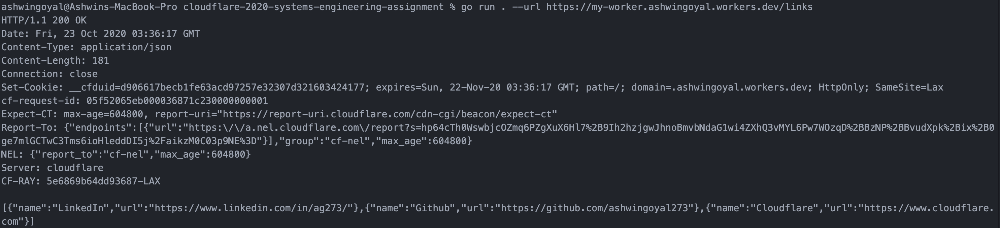
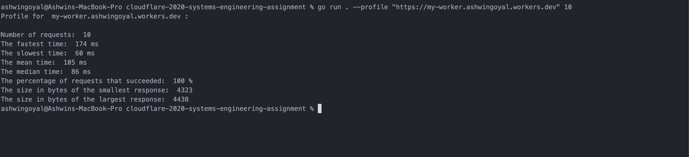
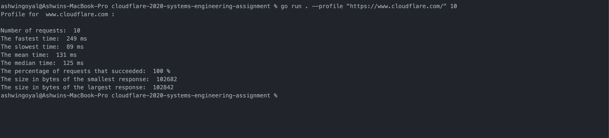
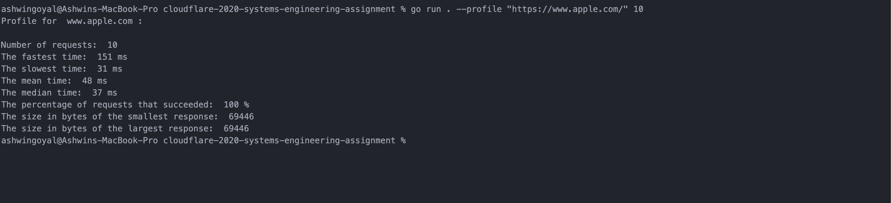
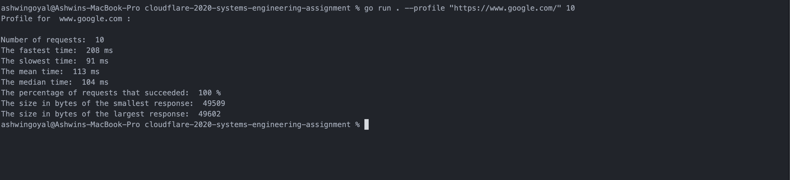

# Systems Assignment

## What is it?

This exercise is a follow-on to the [General Assignment](https://github.com/cloudflare-hiring/cloudflare-2020-general-engineering-assignment), I created a CLI tool which can handle url HTTP requests and return the responses. We can also profile URLs with a particular number of requests using this CLI.

## Instructions to RUN the program

- Install go and setup environment to run go programs. [Official_Link] (https://golang.org/doc/install)
- To get the response from
```
go run . --url <URL>
```
- Use help command to get more details
```
go run . --help
```
- Use the profile command to profile a specified URL over a specified number of requests
```
go run . --profile <URL> <Number of requests>
```
## Results

- Netflix took the most amount of time, my assumption is because of the amount of media they have to load.
- Cloudflare worker loaded fastest when compared to others.

## Screenshots

1. Cloudflare worker site links

2. Cloudflare worker site

3. Cloudflare website

4. Apple website

5. Google.com

6. Netflix

